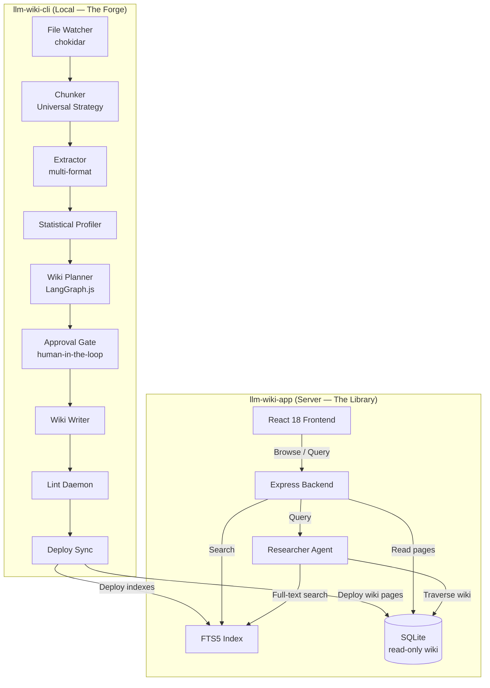
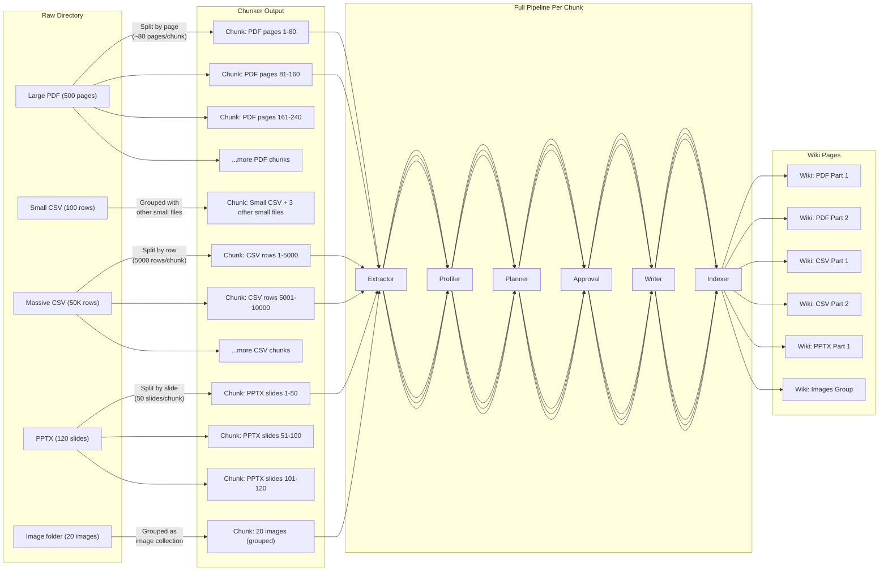
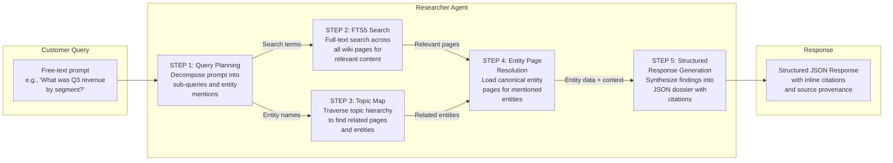

# LLM Wiki Product Suite: Product Vision and High-Level Architecture

| Attribute | Value |
|---|---|
| Document ID | `LLM-WIKI-ARCH-001` |
| Version | 3.0 |
| Status | Canonical |
| Date | 2025-01-15 |
| Audience | All engineering, product, and design stakeholders |

---

## 1. Executive Summary

**LLM Wiki** is a two-product system that transforms a product owner's unstructured raw data files — PDFs, CSVs, PowerPoint decks, Word documents, JSON files, and images — into a browsable, queryable, self-maintaining wiki that serves as a persistent knowledge substrate for AI agents and human researchers. Unlike Retrieval-Augmented Generation (RAG), which computes answers on the fly from raw documents and produces inconsistent, unverifiable results, LLM Wiki compiles raw data into curated, cited, interlinked markdown pages that can be browsed by humans and queried by LLM-powered research agents. The system consists of **llm-wiki-cli**, a local command-line tool that watches, chunks, extracts, profiles, plans, drafts, lints, and deploys wiki content, and **llm-wiki-app**, a full-stack web application where customers browse wiki pages, follow wikilinks, and submit free-text prompts answered by a Researcher Agent that reasons over the compiled wiki rather than raw files. LLM Wiki is designed for product owners, researchers, analysts, and domain experts who accumulate hundreds to thousands of source documents and need a system that not only organizes them but actively maintains cross-references, detects contradictions, and produces structured research outputs on demand.

---

## 2. Product Vision

### 2.1 The Problem

Modern knowledge work produces an ever-growing avalanche of raw data: PDF reports, CSV exports, PowerPoint presentations, Word documents, JSON dumps, and image files. Three failures plague every organization that relies on this data:

1. **Agents drown in raw data.** When an LLM agent is asked a question over a corpus of 400 PDFs and 200 CSVs, it must either retrieve chunks at query time (RAG) or hold everything in context. RAG produces inconsistent answers — the same question yields different chunks, different reasoning, and different conclusions on every invocation. Context-window approaches hit hard limits and are catastrophically expensive.

2. **RAG is ephemeral.** Every query re-computes retrieval and reasoning from scratch. There is no compounding: the system does not get smarter, more organized, or more consistent as the corpus grows. Cross-document insights ("What did Report A say about Topic X, and how does that contradict Dataset B?") are essentially impossible because no persistent structure links sources together.

3. **Human documentation decays.** Traditional wikis, Confluence pages, and Notion databases are manually maintained. They rot: links break, data goes stale, nobody updates them. The effort to manually cross-reference 400 PDFs against 200 CSVs is prohibitive, so it simply does not happen.

### 2.2 The Insight

Agents do not need a magnifying glass that lets them read faster. They need a **map** — a persistent, structured, navigable representation of the knowledge landscape that they can traverse at query time with deterministic, reproducible paths. The map must be:

- **Compiled**, not computed on the fly. The expensive work of extraction, structuring, and cross-referencing happens at ingestion time, not query time.
- **Compounding**, not ephemeral. Every new source enriches the map: new pages, new links, new indexes, new contradictions flagged.
- **Agent-maintained**, not human-maintained. The system writes, links, indexes, and lints itself. Humans approve plans and review outputs, but the mechanical work is automated.

### 2.3 The Solution

LLM Wiki is that map. It is a compounding, LLM-maintained wiki system with three defining properties:

- **Raw data becomes wiki pages.** Every source file (or chunk thereof) is extracted, profiled, and drafted into one or more markdown wiki pages with YAML frontmatter, wikilinks, citations, and structured data embedded inline.
- **Wiki pages form a navigable graph.** A multi-level index system — Master Index, Type Indexes, Topic Maps, and FTS5 full-text search — provides multiple entry points into the knowledge graph.
- **Agents query the wiki, not the raw data.** The Researcher Agent in llm-wiki-app traverses the wiki graph (search → topic → entity → structured response) to answer customer prompts with cited, verifiable, reproducible outputs.

### 2.4 The Two Products

| Product | Role | Deployment | Primary User |
|---|---|---|---|
| **llm-wiki-cli** | Local CLI ingestion engine | Product owner's machine | Product owner / domain expert |
| **llm-wiki-app** | Full-stack web application | Cloud / server | End customer / researcher |

**llm-wiki-cli** is the forge. It watches a `raw/` directory for new or changed files, chunks them, extracts content, runs statistical profiling, drafts wiki page plans, pauses for human approval, writes wiki pages, runs a lint daemon for quality assurance, and deploys the compiled wiki to the llm-wiki-app backend. It is a Node.js executable that runs locally because ingestion involves API keys, large file processing, and human-in-the-loop approval gates that do not belong on a server.

**llm-wiki-app** is the library. It serves the compiled wiki to customers via a React frontend and Express backend. The backend is **read-only** for wiki content — it never accepts ingestion requests. Customers browse pages, click wikilinks, configure their LLM API keys, submit free-text prompts, and receive structured research outputs generated by the Researcher Agent reasoning over the wiki graph.

---

## 3. Core Principles

The following principles guide every architectural, product, and engineering decision. They are listed in priority order.

### Principle 1: The Wiki Is the Source of Truth

Once a raw file is ingested, the wiki page — not the raw file — is the authoritative representation. All querying, linking, and reasoning operate on wiki pages. Raw files are retained as provenance but are never queried directly.

*Why this matters:* This decouples the query system from the heterogeneity of source formats. The Researcher Agent reasons over clean, structured, cited markdown — not over 400 different PDF layouts.

### Principle 2: Compounding, Not Ephemeral

Every ingestion pass makes the wiki strictly better: new pages, new links, updated indexes, detected contradictions, resolved entities. The system never loses structure it has already built.

*Why this matters:* This is the fundamental advantage over RAG. A RAG system queried twice about the same topic may give two different answers. LLM Wiki's answer improves monotonically as the corpus grows because the underlying graph becomes richer.

### Principle 3: Human Approval for Structural Changes

The system drafts plans and pages autonomously, but a human must approve any plan that creates new page structures, modifies existing pages, or deletes content. Automated linting catches errors; humans catch judgment.

*Why this matters:* Full automation produces confident hallucinations. The approval gate ensures that the product owner — the domain expert — validates the system's understanding before it becomes canonical.

### Principle 4: Universal Chunking

The same chunking logic applies to all file types. The rules vary by format (rows for CSVs, pages for PDFs, slides for PPTX, sections for DOCX), but the philosophy is identical: whole files grouped naturally when small; split at semantic boundaries when large. Never at arbitrary byte offsets.

*Why this matters:* A unified chunking model eliminates per-format pipeline forks, reduces code complexity, and ensures every chunk — regardless of origin — flows through the complete ingestion pipeline identically.

### Principle 5: Deterministic Query Paths

Every customer query follows a defined traversal path: FTS5 search → Topic Map → Entity Pages → Structured Response. The Researcher Agent does not freestyle; it executes a query plan against the wiki graph.

*Why this matters:* Deterministic paths make outputs reproducible, debuggable, and testable. When a customer receives a wrong answer, the exact traversal path can be inspected.

### Principle 6: Structured Data Lives in the Wiki

Structured data extracted from raw files (tables, entity records, numerical datasets) is embedded directly in wiki pages as structured markdown content — data tables, definition lists, YAML blocks — not stored in separate SQL tables.

*Why this matters:* This eliminates an entire architectural layer (the structured database), removes synchronization complexity between wiki and database, and makes structured data queryable through the same wiki traversal paths as narrative content. (See Change 1 in Section 10.)

### Principle 7: Quality Is Continuous

A lint daemon runs continuously during and after ingestion, checking for broken wikilinks, orphaned pages, citation integrity, schema compliance, and duplicate entities. Wiki health metrics are surfaced to the product owner.

*Why this matters:* A wiki that is not maintained decays. Automated linting ensures that structural quality is preserved without human effort, and health metrics make quality visible.

---

## 4. High-Level Architecture

### 4.1 The Three-Layer Model

LLM Wiki is organized into three conceptual layers. This is a simplification from earlier four-layer designs (RAW → Structured DB → Wiki → Schema) and is a foundational architectural decision.

```
┌─────────────────────────────────────────────────────────────────────────┐
│  LAYER 3: SCHEMA                                                        │
│  ─────────────                                                          │
│  AGENTS.md          — folder structure, page types, tag taxonomy        │
│  Naming conventions — page titles, file names, slug rules               │
│  Citation rules     — source attribution format and requirements        │
│  Entity resolution  — how duplicates are detected and merged            │
│  Update policy      — when to create, update, or archive pages          │
│  Lint rules         — structural and semantic validation rules          │
└─────────────────────────────────────────────────────────────────────────┘
                                    ▲
                                    │ defines
┌─────────────────────────────────────────────────────────────────────────┐
│  LAYER 2: WIKI                                                        │
│  ─────────────                                                          │
│  Markdown pages     — YAML frontmatter + markdown content               │
│  Wikilinks          — [[Page Name]] cross-references                    │
│  Citations          — inline source attribution                         │
│  Embedded data      — structured tables, entity records, YAML blocks    │
│  Multi-level index  — Master → Type → Topic → FTS5                      │
│  Indexes (SQLite)   — FTS5 full-text, page metadata, link graph         │
└─────────────────────────────────────────────────────────────────────────┘
                                    ▲
                                    │ compiles into
┌─────────────────────────────────────────────────────────────────────────┐
│  LAYER 1: RAW                                                         │
│  ─────────────                                                          │
│  PDFs, CSVs, PPTX   — source files in raw/ directory                    │
│  DOCX, JSON, Images — watched by chokidar file watcher                  │
│  NDJSON, TXT, etc.  — any file type the extractor supports              │
└─────────────────────────────────────────────────────────────────────────┘
```

**Layer 1 — RAW:** The complete, unmodified source files. This layer is watched by the CLI file watcher and serves as provenance for all citations. Raw files are never modified by the system and are never queried directly by the Researcher Agent.

**Layer 2 — WIKI:** The compiled knowledge graph. Every raw file (or chunk thereof) is transformed into one or more markdown wiki pages. Structured data is embedded directly in these pages as markdown tables, definition lists, or YAML blocks. The wiki includes a multi-level index system and FTS5 full-text search. This layer is read-only from the app's perspective; writes only happen via the CLI's deployment sync.

**Layer 3 — SCHEMA:** The governing constitution. `AGENTS.md` defines the rules, conventions, and policies that the ingestion pipeline, wiki writer, and lint daemon follow. It is the single source of truth for how the wiki is structured, what page types exist, how entities are resolved, and how quality is enforced.

### 4.2 The Two Projects: Responsibilities Matrix



### 4.3 Component Diagram: llm-wiki-cli

```mermaid
graph LR
    subgraph "raw/ directory"
        R1[PDF files]
        R2[CSV files]
        R3[PPTX files]
        R4[DOCX files]
        R5[JSON/NDJSON]
        R6[Image files]
    end

    subgraph "llm-wiki-cli"
        direction TB
        WATCH["`**FILE WATCHER**`
chokidar
Detects new/changed/deleted files"]

        CHUNK["`**CHUNKER**`
Universal chunking strategy
Semantic boundary splitting"]

        EXTRACT["`**EXTRACTOR**`
opendocloader-pdf (PDFs)
csv-parse (CSVs)
pptx-extractor (PPTX)
mammoth (DOCX)
JSON.parse (JSON)
Sharp/metadata (Images)"]

        PROFILE["`**STATISTICAL PROFILER**`
Column stats, cardinality
Distribution summaries
Quality scoring"]

        PLAN["`**WIKI PLANNER**`
LangGraph.js pipeline
Drafts page plans per chunk
Proposes links & entities"]

        APPROVE["`**APPROVAL GATE**`
Human reviews plan
Approves / edits / rejects"]

        WRITE["`**WIKI WRITER**`
Generates markdown pages
YAML frontmatter
Wikilinks & citations"]

        LINT["`**LINT DAEMON**`
Broken link detection
Citation integrity
Schema compliance
Entity duplicate check"]

        DEPLOY["`**DEPLOY SYNC**`
Copies pages to backend
Rebuilds FTS5 index
Validates deployment"]
    end

    subgraph "AGENTS.md"
        A1[Folder structure]
        A2[Page type taxonomy]
        A3[Tag taxonomy]
        A4[Citation rules]
        A5[Entity resolution policy]
        A6[Lint rules]
    end

    R1 --> WATCH
    R2 --> WATCH
    R3 --> WATCH
    R4 --> WATCH
    R5 --> WATCH
    R6 --> WATCH

    WATCH --> CHUNK
    CHUNK --> EXTRACT
    EXTRACT --> PROFILE
    PROFILE --> PLAN
    A1 --> PLAN
    A2 --> PLAN
    A3 --> PLAN
    PLAN --> APPROVE
    APPROVE --> WRITE
    A4 --> WRITE
    A5 --> WRITE
    WRITE --> LINT
    A6 --> LINT
    LINT --> DEPLOY
```

### 4.4 Component Diagram: llm-wiki-app

```mermaid
graph LR
    subgraph "Customer Browser"
        UI["`**React 18 Frontend**`
Vite + Tailwind CSS
Wiki page browser
Wikilink navigation
Prompt bar
Config panel"]
    end

    subgraph "llm-wiki-app Backend"
        direction TB
        API["`**Express API**`
REST endpoints
Read-only for wiki"]

        FT["`**FTS5 Search**`
Full-text search index
Multi-field ranking"]

        DB[("`**SQLite**`
better-sqlite3
Wiki pages table
Page metadata table
Link graph table")]

        RA["`**RESEARCHER AGENT**`
Query planner
Wiki graph traversal
Structured response generator"]

        AUTH["`**API Key Management**`
Per-user LLM key storage
Encrypted at rest"]
    end

    UI --> |"GET /pages/:slug"| API
    UI --> |"POST /search"| API
    UI --> |"POST /query"| API
    UI --> |"GET /config"| API

    API --> |"Full-text query"| FT
    API --> |"Read pages"| DB
    API --> |"Submit prompt"| RA
    API --> |"Store/fetch keys"| AUTH

    RA --> |"Search wiki"| FT
    RA --> |"Traverse graph"| DB
```

---

## 5. The Chunking Architecture

Chunking is the critical bridge between raw files and wiki pages. A flawed chunking strategy produces wiki pages that are too large (exceeding LLM context windows during writing), too small (losing cross-section context), or semantically broken (split mid-sentence, mid-table, or mid-slide). LLM Wiki uses a **universal chunking strategy** that applies the same principles across all file types.

### 5.1 Universal Chunking Principles

1. **Semantic boundaries only.** Chunks are never split at arbitrary byte offsets, character counts, or token counts. Every split occurs at a natural boundary: row, page, slide, section heading, or JSON object.

2. **Whole files when small.** If a file (or a group of related files) fits within the chunk size limit, it is processed as a single unit. Small PDFs, short CSVs, and individual images are grouped and processed together when appropriate.

3. **Split when large.** If a file exceeds the chunk size limit, it is divided at semantic boundaries into multiple chunks. Each chunk flows independently through the full ingestion pipeline.

4. **Every chunk is a wiki candidate.** Every chunk — whether it is a single small file, a group of small files, or a slice of a large file — becomes one or more wiki pages. There are no "pass-through" chunks that skip stages.

5. **No sampling.** The full content of every chunk flows through extraction, profiling, planning, and writing. There is no "sample top 50 rows" or "read first 10 pages" anywhere in the pipeline.

### 5.2 Chunk Size Calibration

The chunk size limit is defined in **characters**, not tokens, to avoid per-format tokenization complexity. The default limit is calibrated for mid-level LLMs (e.g., GPT-4o, Claude 3.5 Sonnet) with sufficient headroom for the ingestion pipeline's own prompt overhead:

| Parameter | Default Value | Rationale |
|---|---|---|
| Target chunk size | 100,000 characters | Fits comfortably within ~128K token context windows with headroom for prompts |
| Maximum chunk size | 120,000 characters | Hard ceiling to prevent context overflow |
| Small-file grouping threshold | 20,000 characters | Files below this size may be grouped with other small files |
| Minimum chunk size | 1,000 characters | Chunks below this are flagged for review |

*Why this matters:* Mid-level LLMs offer the best cost-quality tradeoff for ingestion. The chunk size must leave enough context window for the extraction prompt, the extracted content, the profiling prompt, and the wiki writing prompt — all in the same conversation.

### 5.3 Chunking Rules Per File Type

| File Type | Split Boundary | Grouping Behavior | Notes |
|---|---|---|---|
| **CSV** | Row count (e.g., 5,000 rows per chunk) | Multiple small CSVs grouped together | Headers repeated per chunk; no mid-row splitting |
| **PDF** | Page boundaries; section headings when detectable | Multiple small PDFs grouped | Text extraction preserves reading order; tables handled as units |
| **PPTX** | Slide count (e.g., 50 slides per chunk) | Multiple small decks grouped | Slide title + content + notes extracted per slide; no mid-slide splitting |
| **DOCX** | Section/heading boundaries | Multiple small docs grouped | Heading hierarchy preserved; tables handled as units |
| **JSON** | Top-level object boundaries | Array elements grouped when small | NDJSON: one object = one natural unit |
| **NDJSON** | Object boundaries (one line = one object) | Multiple objects grouped when small | Streaming-friendly format |
| **Images** | Individual file (no splitting) | Grouped with other small files in same directory | EXIF metadata + OCR text extracted |
| **TXT / Markdown** | Section/heading boundaries or line count | Multiple small files grouped | Plain text treated as pre-structured content |

### 5.4 End-to-End Chunk Flow



*Why this matters:* The universal chunking model guarantees that no piece of raw data is ever "shortcutted" through the pipeline. A 50,000-row CSV is not summarized into a single page with a "sample" of rows — every row appears in some wiki page. A 500-page PDF is not reduced to an executive summary — every page is extracted and represented. This preserves completeness and makes the wiki a faithful compendium of the raw corpus.

---

## 6. The Wiki Architecture

### 6.1 Multi-Level Index System

The wiki provides multiple navigational entry points, designed to support a corpus of hundreds to thousands of source documents. A customer (or the Researcher Agent) can enter the knowledge graph at any level and traverse downward.

```
Level 0: MASTER INDEX (Dashboard)
├── Overview of entire wiki corpus
├── Statistics: page counts, source counts, coverage by type
├── Recently updated pages
└── Links to all Type Indexes

Level 1: TYPE INDEXES (One per page type)
├── Entity Index        — all entity pages (people, organizations, products)
├── Dataset Index       — all dataset pages (CSV summaries, data dictionaries)
├── Document Index      — all document pages (PDF summaries, report overviews)
├── Topic Index         — all topic/concept pages
└── Source Index        — raw source file catalog

Level 2: TOPIC MAPS (Hierarchical topic clusters)
├── Topic: "Market Analysis"
│   ├── Sub-topic: "Competitive Landscape"
│   ├── Sub-topic: "Market Sizing"
│   └── Related entities and documents
├── Topic: "Financial Data"
│   ├── Sub-topic: "Revenue Metrics"
│   ├── Sub-topic: "Cost Structures"
│   └── Related datasets and entities
└── ... (dynamically generated from tags and links)

Level 3: FTS5 FULL-TEXT SEARCH
├── Indexed across all page content
├── Ranking by relevance + recency
├── Supports phrase queries, boolean operators
└── Powers the initial search step of the query pipeline
```

*Why this matters:* With 400+ source documents, a flat list of pages is unusable. The multi-level index provides structured navigation for humans and deterministic traversal paths for the Researcher Agent. Type indexes answer "What entities do we know about?" Topic maps answer "What do we know about X?" FTS5 answers "Where is Y mentioned?"

### 6.2 Page Types and Format

Every wiki page follows a standard format:

```markdown
---
title: "Q3 2024 Revenue Report — Executive Summary"
created: "2025-01-10T14:32:00Z"
updated: "2025-01-12T09:15:00Z"
type: "document"
tags: ["finance", "revenue", "quarterly-report", "2024-q3"]
sources:
  - file: "raw/reports/q3-2024-revenue.pdf"
    pages: "1-12"
    extracted: "2025-01-10T14:32:00Z"
confidence: "high"
---

# Q3 2024 Revenue Report — Executive Summary

Extracted from [[Source: Q3 2024 Revenue Report PDF]].

## Overview

Total revenue for Q3 2024 was $42.5M, representing a 15% increase
over Q2 2024 and a 23% increase year-over-year [^src1].

## Key Metrics

| Metric | Q3 2024 | Q2 2024 | YoY Change |
|--------|---------|---------|------------|
| Revenue | $42.5M | $37.0M | +23% |
| Gross Margin | 68% | 66% | +2pp |
| Customers | 1,240 | 1,100 | +13% |

## Related Entities

- [[Acme Corp]] — primary revenue source
- [[Jane Smith]] — CFO, quoted in report
- [[Enterprise Segment]] — fastest growing division

## Data Table: Revenue by Segment

| Segment | Revenue | % of Total |
|---------|---------|------------|
| Enterprise | $25.5M | 60% |
| SMB | $12.7M | 30% |
| Consumer | $4.3M | 10% |

[^src1]: raw/reports/q3-2024-revenue.pdf, pages 1-12
```

**Page Types:**

| Type | Description | Example |
|---|---|---|
| `document` | Summary of a source document | A PDF report, a PowerPoint deck |
| `entity` | A named entity (person, org, product) | A company, a person, a product line |
| `dataset` | Structured data summary | A CSV file with statistics and schema |
| `topic` | A conceptual topic or theme | "Market Analysis", "Financial Metrics" |
| `source` | Raw source file catalog entry | Metadata about a raw file |
| `index` | Navigational index page | Type indexes, topic maps |

### 6.3 Entity Resolution Strategy

Entities (people, organizations, products, concepts) that appear across multiple source documents must be resolved to canonical wiki pages. The resolution strategy follows these rules:

1. **Exact name match:** If an entity name appears identically in multiple sources, it is automatically resolved to a single page.
2. **Fuzzy match with confidence threshold:** Similar names ("Acme Corp" vs "Acme Corporation") are flagged for review if similarity exceeds a threshold (default: 0.85 Jaro-Winkler).
3. **Human confirmation for mergers:** The approval gate presents proposed entity mergers; the product owner confirms or rejects.
4. **Disambiguation pages:** When the same name refers to different entities ("Apple" the company vs "Apple" the fruit), a disambiguation page is created linking to both.
5. **Entity pages are authoritative:** Once an entity page exists, all references to that entity across all wiki pages link to the canonical page.

### 6.4 Citation and Provenance Model

Every claim in a wiki page is attributable to a specific location in a specific raw file. The citation system uses footnote-style references:

- `[^src1]` inline references map to a `sources` entry in the YAML frontmatter
- Each source entry specifies: raw file path, page/row range, and extraction timestamp
- The Researcher Agent propagates these citations into its structured responses
- Customers can click citations to see the originating raw file metadata

*Why this matters:* Verifiability is the core differentiator from RAG. A RAG system says "trust me, I read the documents." LLM Wiki says "here is the exact document and page where this claim originates."

---

## 7. The Ingestion Pipeline

The ingestion pipeline transforms raw files into wiki pages through a sequence of seven stages. Every chunk — regardless of file type — flows through all seven stages.

```mermaid
graph LR
    subgraph "Stage 1: FILE DETECTION"
        S1["File Watcher (chokidar)
monitors raw/ directory
Detects: add / change / delete
Emits: file event with path & type"]
    end

    subgraph "Stage 2: CHUNKING"
        S2["Chunker
Applies universal chunking rules
Splits at semantic boundaries
Emits: N chunks with metadata"]
    end

    subgraph "Stage 3: EXTRACTION"
        S3["Extractor
PDF → opendocloader-pdf
CSV → csv-parse
PPTX → pptx-extractor
DOCX → mammoth
JSON → JSON.parse
Images → Sharp + OCR
Emits: structured text per chunk"]
    end

    subgraph "Stage 4: PROFILING"
        S4["Statistical Profiler
Column stats, cardinality
Distribution summaries
Data quality scoring
Entity mention detection
Emits: profile report per chunk"]
    end

    subgraph "Stage 5: PLANNING"
        S5["Wiki Planner (LangGraph.js)
Reads AGENTS.md for conventions
Drafts page plan per chunk
Proposes: pages, links, entities, tags
Emits: draft plan document"]
    end

    subgraph "Stage 6: APPROVAL"
        S6["Human Approval Gate
Product owner reviews plan
Options: approve / edit / reject / defer
Emits: approved plan or revision request"]
    end

    subgraph "Stage 7: WRITING"
        S7["Wiki Writer
Generates markdown per approved plan
Writes YAML frontmatter
Creates wikilinks & citations
Emits: finalized wiki pages"]
    end

    subgraph "Stage 8: INDEXING"
        S8["Indexer & Lint Daemon
Builds FTS5 index
Validates link integrity
Checks schema compliance
Deploys to backend
Emits: deployed wiki + health report"]
    end

    S1 --> S2 --> S3 --> S4 --> S5 --> S6 --> S7 --> S8
```



### Stage Details

| Stage | Input | Output | Responsible Component | Key Decisions |
|---|---|---|---|---|
| 1. File Detection | Raw file on disk | File event (path, type, size, mtime) | chokidar watcher | Debounced; batch processes rapid changes |
| 2. Chunking | File event | List of chunks with boundaries | Universal chunker | Semantic boundary splitting; size calibration |
| 3. Extraction | Chunk + file type | Structured text content | Format-specific extractors | Reading order preservation; table handling |
| 4. Profiling | Extracted text | Statistical profile | Statistical profiler | Column-level stats; entity mention detection |
| 5. Planning | Profile + AGENTS.md | Draft page plan | LangGraph.js planner | Page type selection; link proposals; tag assignment |
| 6. Approval | Draft plan | Approved plan | Human (product owner) | Structural changes require approval |
| 7. Writing | Approved plan | Markdown wiki pages | Wiki writer | YAML frontmatter; wikilinks; embedded data |
| 8. Indexing | Wiki pages | Deployed wiki + indexes | Indexer + lint daemon | FTS5 rebuild; link validation; deployment sync |

---

## 8. The Query Pipeline

When a customer submits a prompt through the llm-wiki-app frontend, the Researcher Agent executes a deterministic query pipeline:



### Query Pipeline Steps

1. **Query Planning:** The Researcher Agent decomposes the customer prompt into a query plan: explicit entity mentions ("Q3 revenue"), implicit topic references ("by segment"), and required output structure (table, summary, comparison).

2. **FTS5 Search:** The query plan's keywords are executed against the FTS5 full-text index. Results are ranked by relevance and recency. Top-N pages (default: 10) are retrieved as initial context.

3. **Topic Map Traversal:** The agent navigates the topic map hierarchy from the pages found in step 2. Related topics, sibling topics, and parent topics are explored to gather broader context.

4. **Entity Page Resolution:** Any entities mentioned in the prompt or discovered in steps 2-3 are resolved to their canonical entity pages. These pages contain the most authoritative, consolidated information about each entity.

5. **Structured Response Generation:** The agent synthesizes all gathered information into a structured JSON response that includes: the answer, supporting evidence, inline citations mapping to raw source files, and confidence levels per claim.

*Why this matters:* The deterministic pipeline makes the Researcher Agent's behavior inspectable and testable. Unlike a RAG system that retrieves arbitrary chunks, every query follows a traceable path through the wiki graph, and every claim in the response can be verified against a specific wiki page and raw source.

---

## 9. Governance and Quality

### 9.1 Lint Daemon Responsibilities

The lint daemon runs continuously after writing and during idle periods. It enforces:

| Check | Severity | Description |
|---|---|---|
| Broken wikilinks | **Error** | `[[Page Name]]` references that do not resolve to an existing page |
| Orphaned pages | **Warning** | Pages with no incoming wikilinks (exempt: index pages) |
| Citation integrity | **Error** | Citations that reference non-existent raw files or invalid page ranges |
| Schema compliance | **Error** | Pages missing required YAML frontmatter fields or with invalid values |
| Duplicate entities | **Warning** | Entity pages with high name similarity that are not linked via disambiguation |
| Stale pages | **Warning** | Pages whose `updated` timestamp is significantly older than their source file's mtime |
| Tag validity | **Error** | Tags not defined in the AGENTS.md tag taxonomy |
| Link graph cycles | **Info** | Circular wikilink references (may be intentional) |

### 9.2 Wiki Health Metrics

The lint daemon produces a health report after each ingestion run:

```json
{
  "timestamp": "2025-01-15T10:30:00Z",
  "total_pages": 847,
  "pages_by_type": { "document": 412, "entity": 203, "dataset": 98, "topic": 89, "index": 45 },
  "errors": 3,
  "warnings": 12,
  "broken_links": 2,
  "orphaned_pages": 8,
  "citation_issues": 1,
  "entity_duplicates_flagged": 4,
  "avg_links_per_page": 6.4,
  "sources_coverage": { "indexed": 847, "raw_files": 412 }
}
```

### 9.3 Approval Gates

The human-in-the-loop approval gate activates at the planning stage. The following changes **always** require approval:

- Creating new page types not in AGENTS.md
- Merging or splitting entity pages
- Deleting existing wiki pages
- Modifying pages with "high confidence" existing content
- Plans flagged by the planner as "uncertain" or "ambiguous"

The following changes **may** be auto-approved (configurable):

- Adding new pages for new source files (default: auto-approve)
- Updating pages when source files change (default: require approval)
- Adding wikilinks to existing pages (default: auto-approve)

---

## 10. Technology Stack

### llm-wiki-cli Stack

| Layer | Technology | Purpose | Why This Choice |
|---|---|---|---|
| Runtime | Node.js 20+ | CLI execution | Ecosystem maturity; file system APIs; async I/O |
| File Watching | chokidar | Detect file changes | Industry standard; cross-platform; battle-tested |
| PDF Extraction | opendocloader-pdf | PDF text extraction | Maintained; preserves reading order; table support |
| CSV Parsing | csv-parse | CSV/TSV parsing | Fast; streaming; RFC 4180 compliant |
| PPTX Extraction | pptx-extractor | PowerPoint text extraction | Native slide-level access; notes extraction |
| DOCX Extraction | mammoth | Word document extraction | Clean markdown output; heading preservation |
| Image Processing | Sharp + Tesseract.js | Image metadata + OCR | Sharp for fast metadata; Tesseract for OCR |
| Ingestion Pipeline | LangGraph.js | Planner graph execution | Graph-based agent orchestration; state management |
| LLM Client | OpenAI SDK + custom adapters | LLM API calls | Multi-provider support (OpenAI, Anthropic, etc.) |
| Markdown | remark + unified | Markdown parsing/writing | Ecosystem standard; plugin architecture |
| Deployment | rsync / custom sync | Copy wiki to backend | Simple; reliable; incremental |

### llm-wiki-app Stack

| Layer | Technology | Purpose | Why This Choice |
|---|---|---|---|
| Frontend Framework | React 18 | UI components | Mature; large ecosystem; component model |
| Build Tool | Vite | Development + production | Fast HMR; modern bundling; minimal config |
| Styling | Tailwind CSS | Utility-first CSS | Rapid development; consistent design system |
| Backend | Express.js 4 | HTTP API | Minimal; fast; middleware ecosystem |
| Database | better-sqlite3 | SQLite access | Synchronous API; FTS5 support; embedded |
| Full-Text Search | SQLite FTS5 | Full-text index | Native SQLite; fast; ranking support |
| LLM Integration | OpenAI SDK | Researcher Agent | Streaming support; function calling |
| State Management | React Context + hooks | Frontend state | Sufficient complexity; no boilerplate |
| Routing | React Router | SPA navigation | Declarative; URL-based state |

---

## 11. Security and Privacy Model

| Concern | Approach | Rationale |
|---|---|---|
| LLM API Keys | Stored per-user in the app backend, encrypted at rest (AES-256) | Keys never leave the server; each user uses their own API key |
| Raw File Storage | Raw files remain on the product owner's local machine | Sensitive source data never uploaded to the server |
| Wiki Content | Deployed wiki pages contain extracted content, not raw files | Minimizes exposure of source documents |
| Transport | HTTPS for all client-server communication | Standard encryption in transit |
| CLI Local Execution | All ingestion runs locally; no raw data transmitted during processing | Zero-trust model for sensitive data |
| Authentication | API key-based for the app; local filesystem for the CLI | Simple; no user database required for CLI |

---

## 12. Scaling Roadmap

The architecture is designed to evolve gracefully as the corpus grows. The following table describes what changes at each scale threshold.

| Scale | Corpus Size | What Changes |
|---|---|---|
| **Phase 1: Bootstrap** | 1-10 sources | CLI runs on demand (not daemon). Manual approval for every plan. FTS5 rebuilds on every deploy. Single deployment target. |
| **Phase 2: Operational** | 10-100 sources | File watcher daemon active. Auto-approval for straightforward plans. Incremental FTS5 updates. Lint daemon runs continuously. |
| **Phase 3: Scale** | 100-1,000 sources | **Current target.** Parallel chunk processing. Batch approval interface (review 10 plans at once). Topic maps auto-generated from link graph. Entity resolution automated with human override. |
| **Phase 4: Growth** | 1,000-10,000 sources | Sharded FTS5 indexes by topic or time period. Background re-ingestion for stale sources. Automated contradiction detection across entity pages. Distributed deployment (multiple backend instances). |
| **Phase 5: Enterprise** | 10,000+ sources | Multi-tenant wiki isolation. Advanced analytics on wiki usage. Custom page type definitions per tenant. Real-time collaborative editing. Versioned wiki snapshots. |

*Why this matters:* The current architecture (Phase 3) is designed for the product owner's immediate need (~400 PDFs). The three-layer model, universal chunking, and multi-level index system all have clear extension paths for larger scales without fundamental redesign.

---

## 13. Architectural Changes: Version History

The following table documents the architectural evolution that led to this version.

| Version | Date | Change | Rationale |
|---|---|---|---|
| 1.0 | — | Initial prototype ("Graver AI") | Single monolithic application |
| 2.0 | — | Split into llm-wiki-app and llm-wiki-cli | Separation of concerns: forge vs. library |
| 2.1 | — | Four-layer model: RAW → Structured DB → Wiki → Schema | Structured data stored in SQLite tables |
| 2.2 | — | Multi-level index system added | Support for 400+ PDF navigation |
| 2.3 | — | Loop engineering methodology defined | Quality assurance for agent-generated content |
| **3.0** | **Current** | **Three-layer model: RAW → WIKI → SCHEMA** | Eliminated separate SQL layer; structured data embedded in wiki pages. Simpler architecture; no sync complexity. |
| **3.0** | **Current** | **End-to-end chunking (no sampling)** | Every chunk flows through the complete pipeline. No "sample top 50 rows." Full fidelity guarantee. |
| **3.0** | **Current** | **Universal chunking strategy** | Same chunking philosophy for all file types. Semantic boundary splitting. No arbitrary byte offsets. |
| **3.0** | **Current** | **PowerPoint (PPTX) as first-class format** | Split by slide count. Same pipeline as PDFs/CSVs. Extracted as structured markdown. |

---

## 14. Glossary

| Term | Definition |
|---|---|
| **AGENTS.md** | The constitutional document that defines folder structure, page types, tag taxonomy, naming conventions, citation rules, entity resolution policy, update policy, and lint rules for the wiki. |
| **Approval Gate** | The human-in-the-loop checkpoint in the ingestion pipeline where the product owner reviews and approves, edits, or rejects wiki page plans before they are written. |
| **Chunk** | A unit of raw file content produced by the chunker. Chunks are sized to fit within LLM context windows and are split at semantic boundaries. Every chunk flows through the complete ingestion pipeline. |
| **Chunking** | The process of dividing raw files (or grouping small files) into processing units that fit within LLM context windows, split at semantic boundaries (row, page, slide, section). |
| **Citation** | A footnote-style reference in a wiki page (`[^src1]`) that maps to a specific location in a specific raw source file, providing verifiable provenance for claims. |
| **Compounding** | The property of the wiki system where each new ingestion makes the knowledge graph strictly richer — new pages, new links, new indexes — rather than merely adding data. |
| **Entity** | A named real-world object (person, organization, product, concept) that appears in source documents and has a canonical wiki page. |
| **Entity Resolution** | The process of determining whether two entity mentions in different sources refer to the same real-world entity, and merging them into a single canonical wiki page. |
| **Extractor** | The component that converts raw file content into structured text. Each file type has a dedicated extractor (PDF, CSV, PPTX, DOCX, JSON, Image). |
| **FTS5** | SQLite's full-text search extension (version 5), used for fast full-text search across all wiki page content. |
| **Human-in-the-Loop (HITL)** | The design pattern where automated systems draft outputs but require human approval before those outputs become canonical. |
| **Index (multi-level)** | The hierarchical navigation system consisting of Master Index → Type Indexes → Topic Maps → FTS5 Search, providing multiple entry points into the wiki graph. |
| **Ingestion Pipeline** | The seven-stage process (File Detection → Chunking → Extraction → Profiling → Planning → Approval → Writing) that transforms raw files into wiki pages. |
| **LangGraph.js** | The JavaScript library used to orchestrate the planner agent's graph-based reasoning in the ingestion pipeline. |
| **Lint Daemon** | The continuously running quality checker that validates wiki pages for broken links, citation integrity, schema compliance, and duplicate entities. |
| **LLM Wiki** | The overarching product suite consisting of llm-wiki-cli and llm-wiki-app. |
| **llm-wiki-app** | The full-stack web application where customers browse wiki pages and submit queries to the Researcher Agent. |
| **llm-wiki-cli** | The local command-line tool that runs on the product owner's machine to ingest raw files and produce wiki pages. |
| **Page Type** | The classification of a wiki page (document, entity, dataset, topic, source, index) that determines its structure, required frontmatter, and indexing behavior. |
| **Profiling (Statistical)** | The stage of the ingestion pipeline that computes statistics (cardinality, distributions, quality scores) over extracted content, particularly for structured data. |
| **Query Pipeline** | The five-step process (Query Planning → FTS5 Search → Topic Map → Entity Pages → Structured Response) that the Researcher Agent executes to answer customer prompts. |
| **RAG** | Retrieval-Augmented Generation, the conventional approach where LLMs retrieve document chunks at query time. LLM Wiki replaces RAG with pre-compiled wiki pages. |
| **Raw File** | A source document in its original format (PDF, CSV, PPTX, DOCX, JSON, Image) stored in the `raw/` directory. |
| **Researcher Agent** | The LLM-powered agent in llm-wiki-app that traverses the wiki graph to answer customer prompts with structured, cited responses. |
| **Semantic Boundary** | A natural division point in a file (row boundary in CSV, page boundary in PDF, slide boundary in PPTX, section heading in DOCX) at which chunking may split content. |
| **Three-Layer Model** | The architectural model consisting of RAW (source files) → WIKI (compiled markdown pages) → SCHEMA (governing rules in AGENTS.md). |
| **Topic Map** | A hierarchical page in the wiki that clusters related pages by topic, providing navigational context and discovery. |
| **Universal Chunking** | The data-type-agnostic chunking strategy that applies the same principles (semantic boundaries, whole-when-small, split-when-large) across all file formats. |
| **Wikilink** | A cross-reference between wiki pages in the format `[[Page Name]]`, forming the link graph that the Researcher Agent traverses. |
| **Wiki Page** | A single markdown file in the wiki, consisting of YAML frontmatter (metadata) and markdown content (including wikilinks, citations, and embedded structured data). |
| **Wiki Planner** | The LangGraph.js agent that drafts wiki page plans based on extracted content, statistical profiles, and AGENTS.md conventions. |
| **Wiki Writer** | The component that generates finalized markdown wiki pages from approved plans, including YAML frontmatter, wikilinks, and citations. |
| **YAML Frontmatter** | The metadata block at the top of each wiki page (between `---` delimiters) containing title, dates, type, tags, sources, and confidence. |

---

*This document is the canonical architectural reference for the LLM Wiki product suite. All other design documents, implementation plans, and API specifications must be consistent with the decisions, principles, and definitions contained herein. Changes to this document require explicit version bump and changelog entry.*
