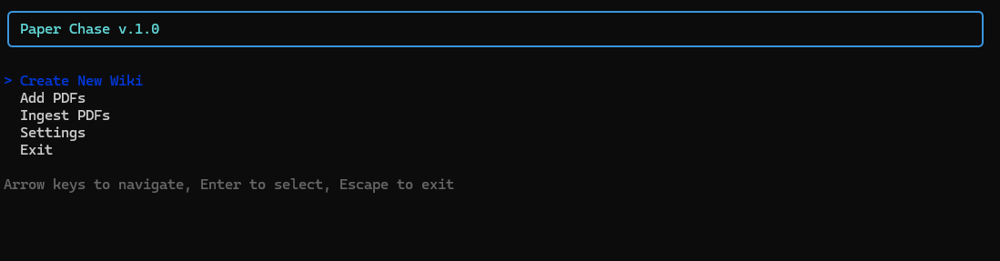

# Paper Chase

**The paper chase, automated.** You bring the documents. It does the chasing.

## Introduction

Paper Chase is a local CLI/TUI that ingests a pile of PDFs — reports, filings, transcripts, letters — and produces a structured markdown wiki: one page per entity (people, organizations, places, …), topic pages that roll entities up, rich composite pages that pool logically-mapped entities into one article, comparison articles that preserve multi-subject data tables verbatim, document pages for every ingested PDF, and `AGENTS.md` navigation contracts (the DOX contract) throughout. Every entity, relationship, and claim on every page carries a citation of the form `\\\[Source Name, p. N]`, and a deterministic validation pass checks that every link resolves, every citation points at a real source page, and every page matches its schema. Re-running ingest on the same folder is incremental: unchanged PDFs (by SHA-256) are skipped, new information is merged into existing pages, and manual edits are never overwritten — they are logged as conflicts instead.

**Just want the app? (Windows .exe)** You don't need Node.js:

1. Build it once with `npm install` + `npm run package:win` → `dist\\paper-chase.exe` (or take a prebuilt copy).
2. Put the exe in the folder that should hold your `wikis\\` workspace and double-click it — the first launch unpacks its runtime once, then the terminal UI opens.
3. **Create New Wiki → Add PDFs → Ingest PDFs**, then browse the generated `wikis\\<slug>\\` folder in Obsidian or any markdown viewer. (`paper-chase.exe init` / `ingest` also work from a terminal.)

Details: [Windows Executable](#windows-executable). **Rebuild the exe after upgrading** — it embeds the code it was built from; `npm run package:win` refreshes it.



*The main menu — five items, and everything a wiki needs starts here.*

\---

## Your First Wiki — a Friendly Walkthrough

Never used Paper Chase? You have a pile of PDFs and ten minutes. Here's the whole thing, end to end.

**0. Launch it.** Double-click `paper-chase.exe` (Windows) or run `chase` / `npm run cli` in a terminal. A menu appears with five items — everything happens from there.

**1. Settings (once).** Open **Settings** from the menu.

* **API key:** scroll to the **API Keys** section, press Enter on your provider's row, paste your key, and **Save**. It's stored locally in `.paper-chase.json`, shown only as `••••last4` — never in full, never in logs. (Prefer the environment? `ANTHROPIC\_API\_KEY`, `OPENAI\_API\_KEY`, or `DASHSCOPE\_API\_KEY` work too, no Settings entry needed. Custom providers keep their key in the provider config.)
* **Models:** the defaults are sensible — a cheap model for extraction and a stronger one for writing, with an inline recommendation label under each role. No changes needed to start.
* **Toggles:** make sure **Synthesis** is **on** — that's what turns raw extractions into readable prose pages.

**2. Create your wiki.** **Create New Wiki** → give it a **Title** (the folder slug is derived automatically) and a **Workspace** (the folder your wikis live in). Pick the **Output Language** — the language *you want to read the wiki in* (default English). Done: your wiki now exists with a `raw/` folder and its own `AGENTS.md` constitution. The app offers to take you straight to adding PDFs.

**3. Add PDFs.** **Add PDFs** → **Browse…** opens your system's normal file picker — select one or many PDFs at once. They're copied into the wiki's `raw/` folder. When asked **Start ingesting now? \[Y/n]**, say yes (or come back to **Ingest PDFs** anytime).

**4. Ingest.** Select your wiki, then set the **Input Language** — the language *the PDFs are written in* (Danish reports? Pick Dansk). This matters for clean names and page slugs; the output language was already fixed when you created the wiki. Press Enter and watch it work: text extraction → a quick **curation** pass that folds duplicate names together (most routine ones for free, deterministically; decisions stick between runs) → prose writing (`Synthesis: N/M pages complete (4 workers)`) → navigation contracts. It ends with `Ingest complete: X ingested, Y skipped.` — plus what it cost (`.state/metrics.json`; a dense two-PDF run with synthesis is roughly tens of dollars and \~1–2 hours, small ones are pennies and minutes). Unchanged PDFs are skipped automatically on later runs, and anything already written is never re-bought.

**5. The AGENTS.md proposal (if offered).** After an ingest, the app may have learned new structure and drafted an update to your wiki's constitution. The success screen says `press \\\[P] to review the diff` — read the proposed changes inline, then **A** to apply them or **R** to keep the proposal on disk for later (nothing is ever applied without you).

**6. Read your wiki in Obsidian.** This is the recommended way to browse: open the `wikis/` folder as an Obsidian vault (or just your one wiki's folder). Everything is plain markdown — entity, topic, composite (several logically-mapped entities as one rich article), comparison (verbatim data tables), and cross-wiki pages with prose up top and verbatim evidence below, `\\\[\\\[links]]` between pages, and a citation like `\\\[^src1]` behind every claim that jumps you to the exact PDF page. When your workspace has more than one wiki, the `cross-wiki/` folder holds a workspace-level entity registry, relationship graph, topic clusters, and hypothesis signals. Thin pages are honestly marked `sparse: true` so you never waste time on them.

*Feeding it more later:* drop new PDFs into `raw/` and ingest again — Paper Chase only processes what's new and merges it into the pages you already have.

\---


## Known Limitations (from the Backlog)

Need-to-know only; the full list with mechanisms and fix plans lives in [`Implementation Plan/BACKLOG.md`](Implementation%20Plan/BACKLOG.md).

* **~~Validation noise on synthesized pages~~ — fixed (Phase 17, 2026-07-28):** frontmatter (`title`/`type`/`wiki`/`updated`/`sources`/`aliases`/`sparse`) is now deterministically re-imposed over every synthesized page and created when the model omits it, `## Sources` definitions are rebuilt in resolvable basename form, and a body-vs-frontmatter consistency check watches the rest. `missingSource` and schema flags dropped to zero on the wikis rebuilt since.
* **The very densest pages stay templates:** an entity/topic whose preserved evidence exceeds the model's output ceiling keeps the deterministic structured template (all data, no prose) — rare (\~2% of pages).
* **~~Curation re-decided everything every run~~ — fixed (Phase 21, 2026-07-29):** merge/drop/cluster decisions are now sticky — recorded in `.state/curation-decisions.json` and pre-applied deterministically, so the model only ever judges NEW candidates (a manual `splits` list is the escape hatch). Most routine merges no longer need a model at all: a deterministic pre-merge tier applies transliteration/alias-exact pairs for free, and the model confirms proposed pairs instead of discovering them. neverMerge pins in `.state/curation-overrides.json` still win, and the keep-all fallback is unchanged.
* **PDF text only (for now):** DOCX, scanned/image-only PDFs, and standalone images are on the backlog as a future multi-format ingestion track.
* **API keys live in `.paper-chase.json`** (gitignored) — never commit it.

## Functional Architecture

From the user's seat, the app is a terminal UI with five menu items:

1. **Create New Wiki** — name a wiki; Paper Chase scaffolds `wikis/<slug>/` with a `raw/` folder and the root `AGENTS.md` contract.
2. **Add PDFs** — copy PDFs into `wikis/<slug>/raw/` using the native file picker (or by pasting a path). Afterwards the app offers to start ingesting immediately.
3. **Ingest PDFs** — run the pipeline over every new or changed PDF in `raw/`, with live progress (`\\\[██████████] Chunk 1/1 ...`) and a closing summary: `Ingest complete: X ingested, Y skipped. Synthesis: A pages written (B strict, C permissive), D conflicts. Validation passed.` If the run wrote an AGENTS.md update proposal, the success screen offers a `p` shortcut into a diff review: `A` replaces the wiki's AGENTS.md with the proposal, `R` does nothing (the proposal stays on disk for later manual review). The review screen is flow-only — it has no menu entry. Cost calibration (July 2026, Anthropic mid-tier routing): a dense two-PDF Danish ingest with synthesis ran **\~$34 and \~95 minutes** end-to-end — extraction is cheap (\~$0.05/chunk), synthesis of prose is most of the bill, and curation costs pennies.
4. **Settings** — toggle synthesis and AGENTS.md update proposals, pick the LLM provider (Anthropic, OpenAI, Qwen, or a custom OpenAI-compatible provider), choose which model each pipeline role uses (Default, Extractor, Synthesis Writer, DOX Writer, Curation, Cross-Wiki Bulk, Cross-Wiki Judgment), and enter API keys (masked, stored locally). Settings persist to `.paper-chase.json`.
5. **Exit**.

The same operations exist as plain commands for scripts and power users:

```bash
npm install
npm link            # puts `chase` on your PATH

chase                        # launch the TUI
chase init my-case           # create wikis/my-case/
chase ingest my-case         # ingest everything new in raw/
chase ingest my-case --synthesis       # also write LLM prose pages
chase ingest my-case --update-agents   # also propose AGENTS.md updates
chase ingest my-case --no-cross-wiki   # skip the cross-wiki discovery pass
chase test                   # run the test suite
```

Without `npm link`, the equivalent is `npm run cli -- …` (e.g. `npm run cli -- ingest my-case --synthesis`).

Browse the result by opening `wikis/<slug>/` in any markdown viewer (Obsidian, VS Code, GitHub). `index.md` at the wiki root links the workspace-level index; entity pages live under `entities/`, topic pages under `topics/`, per-PDF pages under `documents/`, and source records under `sources/`. Thin entity pages (one or two mentions, no significant claims or relationships) carry `sparse: true` in frontmatter and say so honestly in prose — an honest sparse page is a correct page, never padded to look substantial. Pages that absorbed name variants of the same real-world thing (curation merges) list the old names in `aliases`, so they still find the page.

## Step-by-Step Architecture

### The Pipeline at a Glance

Legend: 🤖 = LLM agent (model slot in Settings) · ⚙ = deterministic code

```
chase init <slug>            ⚙ scaffold wikis/<slug>/ + AGENTS.md constitution
                               from the template (no LLM)
        │
Add PDFs                     ⚙ native file picker → wikis/<slug>/raw/
        ▼
INGEST  ─────────────────────────────────────────────────────────────────
        │
        ├─ Hash check        ⚙ SHA-256: unchanged PDFs skipped; every finished
        │                      PDF checkpointed to .state/ingestion.json
        ▼
  Layer 1 · Extraction       ⚙ pdfjs-dist → page chunks
        │                      → documents/<source>-part-NNN.md
        ▼
  Layer 2 · Extractor        🤖 per chunk (default: Haiku)
        │                      chunk + rolling memory + constitution
        │                      → strict JSON: entities, relationships,
        │                        claims, timeline, comparison TABLES
        │                        → .state/extracted/
        │                      invalid JSON/schema → reask ≤3 with the
        │                      validator's exact errors; exhaustion aborts
        ▼
  Layer 3 · Materializer     ⚙ aggregate all chunks; create folders
        │
        ├─ Curation          ⚙+🤖 sticky + deterministic-first (runs when
        │  (curate-then-write)   synthesis is on and extraction data exists)
        │                      ⚙ sticky pre-application: recorded merges/drops/
        │                        clusters re-applied from
        │                        .state/curation-decisions.json (splits list =
        │                        manual escape hatch)
        │                      ⚙ pre-merge signals: transliteration/alias-exact
        │                        auto-applied FREE; abbreviations, subsequences,
        │                        region/indicator families, glossary proposed
        │                      🤖 ×2 in parallel (default: Sonnet) CONFIRMS
        │                        proposed pairs + open-discovery on the rest:
        │                        topic merge/drop, entity merge-only, entity
        │                        CLUSTERS (2-4 logically-mapped entities → one
        │                        composite page, five ratified classes)
        │                      → deterministic validation → all-or-nothing
        │                      → any failure: keep-all fallback, zero data loss
        │                      → .state/curation-report.json
        │
        ├─ Write/update      ⚙ entity + topic + COMPOSITE + COMPARISON pages
        │   pages                (structured templates; sparse: true on thin
        │                        pages; manual edits skipped → conflict log;
        │                        stale tool-written hashes converge, never
        │                        false-flag; finished pages preserved
        │                        byte-for-byte)
        ▼
  Validate content pages     ⚙ links, citations, frontmatter
        ▼
  Layer 4 · Synthesis        🤖 per page (default: Sonnet; worker pool ×4;
        │                        four stages: entity, topic, composite,
        │                        comparison)
        │                      strict → preservation check → permissive →
        │                      structured template (data never lost)
        │                      validator feedback (reask ≤3) inside each mode
        │                      prompt slots: related-entity link targets +
        │                        CITATION KEYS (off-map markers = defect)
        │                      write-point enforcement: full frontmatter,
        │                        basename ## Sources, wikilink repair
        │                      transport failure → template fallback for that
        │                        page only (outage detector: 5-in-a-row or
        │                        >10% of a stage → run aborts, fail loud)
        │                      passed pages fingerprinted →
        │                        .state/synthesis-state.json → re-runs skip
        │                        them; template pages are retried
        ▼
  Validate ────────────────  ⚙
        ▼
  Layer 5 · DOX Writer       🤖 per folder + wiki root (default: Sonnet;
        │                        sequential, bottom-up)
        │                      → index.md navigation contracts
        │                      children/statistics re-imposed deterministically
        │                      wikilinks repaired; deterministic fallback
        │                      → workspace pass: wikis/index-of-indexes.md
        ▼
  Layer 6 · Cross-Wiki       🤖+⚙ workspace discovery pass (default: cheap for
     Discovery                 bulk components; mid-tier for judgment calls)
        │                      only when ≥2 wikis; skipped when unchanged
        │                      → wikis/cross-wiki/entity registry, relationship
        │                        graph, topic clusters, hypothesis signals
        ▼
  Final validation + state   ⚙ metrics.json, rolling memory, reports
        ▼
  AGENTS.md Updater          🤖 opt-in (default: cheap tier) — proposes
        │                      constitution updates → .state/proposed-agents.md
        │                      applied ONLY by a human action (never automatic)
        ▼
FINISHED WIKI — open wikis/ in Obsidian: entities/, topics/, comparisons/, documents/,
sources/, cross-wiki/, index.md contracts everywhere, every claim cited \[^srcN]
──────────────────────────────────────────────────────────────────────────
```

The numbered layers in detail:

Ingestion is a five-layer pipeline. Each layer's output is the next layer's input, and every layer is either fully deterministic or an LLM agent with a deterministic safety net.

1. **Layer 1 — Deterministic extraction.** Each PDF in `raw/` is hashed (SHA-256); files whose hash is already recorded in `.state/ingestion.json` are skipped. New PDFs are parsed with `pdfjs-dist` (the only PDF parser — the Phase 10 alternative engine was rolled back) and split into page-ranged chunks, which are written as markdown document pages under `documents/` with page-accurate source mapping.
2. **Layer 2 — Extractor (LLM agent).** Each chunk is sent to the Extractor with the rolling memory (known entities, folder structure) and the extractor prompt. It returns strict JSON: entities (new and recurring), relationships, typed claims, timeline events, structured comparison tables (with subject, dimensions, and a reconstructed markdown rendering — the structure is the model's, the values must be the PDF's), and per-chunk context — every item with a page citation. The JSON is validated against the extraction schema and saved to `.state/extracted/<chunkId>.json`.
3. **Layer 3 — Materializer (deterministic).** The extraction JSON is merged into the rolling memory: new entity and topic pages are scaffolded, recurring entities get new mentions/relationships/claims appended, and duplicates are folded together. Pages a journalist edited by hand since the last run are detected by hash and skipped (logged as manual-edit conflicts, never overwritten). When synthesis is enabled and extraction data exists, a **Curation** sub-stage (LLM agent + deterministic validation) runs between aggregation and page writing: one call for topics (merge same-theme duplicates, drop meta-descriptors, keep the rest) and one merge-only call for entities (same thing under different wording/spelling, e.g. forked `odense`/`odense-2` pages), each validated deterministically (every candidate exactly once, no self-merges, merge chains resolved) and applied all-or-nothing — merges union claims/mentions/relationships, absorb the merged-away titles as `aliases`, rewrite affected wikilinks across all pages, and delete the merged-away pages. On any validation/transport failure the sub-stage falls back to keep-all (a warning is printed, the run is byte-identical to no curation, `metrics.curationFallbacks` is incremented); `.state/curation-overrides.json` lets a user pin `neverMerge` pairs, and every run writes `.state/curation-report.json`. Since Phase 21 the sub-stage is sticky and deterministic-first: recorded decisions are pre-applied from `.state/curation-decisions.json` (a manual `splits` list is the escape hatch), a deterministic pre-merge tier auto-applies near-zero-risk pairs (transliteration forks, alias-exact abbreviations) for free and proposes the rest with signals (corpus-derived abbreviations, subsequences/initials, region name-form and indicator families, a small domain glossary), and the model confirms proposals plus open-discovers over what's left — so a merge is paid for once and never re-litigated. Since Phase 22 entity curation can also form CLUSTERS: 2–4 logically-mapped entities within five ratified classes (abbreviation/name-variant, brand↔generic substance, indicator↔measured concept 1:1, facility↔city when the facility is the city's story, same-name different-type) become one COMPOSITE page — the graph stays entity-granular, only presentation clusters; member pages are not written, member names accumulate as aliases, and member-targeted links rewrite to the composite. Since Phase 23 the extractor's `tables` output is assembled into COMPARISON articles under `comparisons/`: one page per table subject (canonical entity identity, so renamed or renumbered tables reconcile onto one page), each source's table preserved verbatim in its own dated section, plus a deterministic bridge to the prose claims that share the table's entities.
4. **Layer 4 — Synthesis Writer (LLM agent, opt-in).** Each materialized page — entity, topic, composite, or comparison — is rewritten into prose. Strict synthesis must pass a **preservation check** (no mention, relationship, claim, table row value, or citation from the deterministic page may be dropped — and since Phase 18 the model is shown the page's legal CITATION KEYS, so a citation marker outside that list is itself a defect fed back for correction); if it fails, the fallback chain is **strict → permissive → structured template**: permissive synthesis retries with a relaxed prompt, and if preservation still fails the page falls back to the deterministic structured template so data is never lost. Failures are logged to `.state/conflicts.json`. The entity and topic synthesis loops run through a bounded worker pool at a fixed 4 concurrent calls (a constant, not a setting) with a deterministic 250 ms dispatch stagger between pickups so a stage never fires 4 large requests at the same instant: per-page outcomes are identical to sequential processing, synthesis-report entries are written once per stage in original page order, progress is an aggregate `Synthesis: N/M pages complete (4 workers)` line, and the `llm-calls.json`/`conflicts.json` appends pass through a serialized write queue so concurrent workers never interleave writes. Every other stage (extraction, curation, DOX, workspace, updater) stays sequential. At the write points every synthesized page is deterministically finished: the complete frontmatter is re-imposed (created when the model omitted it; `updated` is the real write time), `## Sources` definitions are rebuilt in resolvable basename form, and broken wikilinks are conservatively repaired (unique-prefix/alias matches only; ambiguous targets are left and reported). Relationships render both directions — an entity sees the relationships it is the OBJECT of, marked `(incoming)`, so object pages are never blind — and prompts carry the legal related-entity link targets, so thin pages are no longer islands. Resilience (see **Run resilience** below): a page whose transport fails out after the client's bounded retries lands on the structured template with a loud warning (`finalMode: 'transport-fallback'`, counted in `metrics.transportFailures`) instead of killing the run, while an outage detector aborts the run when 5 pages in a row transport-fail or more than 10% of a stage's pages do — and pages that already passed synthesis are fingerprint-recorded in `.state/synthesis-state.json` so a re-run skips them (no re-buying) while template pages are retried.
5. **Layer 5 — DOX Writer (LLM agent + deterministic enforcement).** `AGENTS.md` and `index.md` contracts are regenerated for every folder so both humans and agents can navigate the wiki; a deterministic enforcement pass guarantees valid contracts even with no API key, and unresolvable wikilinks are repaired.
6. **Layer 6 — Cross-Wiki Discovery (workspace pass, optional, fault-tolerant).** After the per-wiki DOX contracts and workspace index are written, a workspace-level pass discovers links across all wikis in the workspace — but only when the workspace contains ≥2 wikis. It runs only when the set of wikis changed, entity/topic content pages changed, or the cross-wiki artifacts have never been built; a deterministic fingerprint in `.state/cross-wiki/run-fingerprint.json` skips redundant runs. A cheap-LLM relevance probe can further skip the full pass when changes are confined to one wiki and clearly local. The pass is additive and read-only: it never edits per-wiki pages. It produces (A) an **entity registry** (`wikis/cross-wiki/entities.md`) of entities that appear in ≥2 wikis, (B) a **relationship graph** (`wikis/cross-wiki/relationships.md`) of edges that cross wiki boundaries or touch a cross-wiki entity with canonical predicates, (C) **topic clusters** (`wikis/cross-wiki/topics/<cluster-id>.md`) of related topics across wikis, (D) **hypothesis signals** (`wikis/cross-wiki/signals.md`) highlighting contradictions, gaps, or confirmations across wikis, plus deterministic index contracts (`wikis/cross-wiki/index.md`, `wikis/cross-wiki/topics/index.md`). JSON mirrors of each artifact live under `.state/cross-wiki/`. Each LLM component uses the `crossWiki` (cheap/bulk) or `crossWikiJudgment` (mid-tier review) slot in Settings; uncertain matches are recorded in `.state/proposed-cross-wiki-matches.json` for human review rather than applied. If any component fails, the pass logs a warning and continues, so an ingest never aborts because of cross-wiki discovery. Use `chase ingest <slug> --no-cross-wiki` to skip it entirely.

Rejection loops and criteria: LLM failures fall into four bounded classes — **deterministic** failures (HTTP 4xx such as auth or invalid request) are never retried and never fall back per page: they fail immediately so the key, model, or configuration can be fixed and the ingest re-run; **transient** transport failures (429/5xx/network/timeouts) retry inside the LLM client with exponential backoff (5s → 15s → 45s) up to 3 total attempts — and when they are still throwing after those retries at a per-page synthesis stage, only that page falls back to the deterministic structured template (logged loudly, counted in `metrics.transportFailures`, retried on the next run), while a per-stage **outage detector** aborts the run with the transport error when 5 pages transport-fail consecutively or more than 10% of a stage's pages do (a real outage must still fail loud); **content-defect** failures (invalid Extractor JSON, extraction schema-validation errors) and **quality** failures (a synthesis page that fails the preservation check, an unparseable/incomplete DOX Writer or workspace-pass response, an AGENTS.md-updater proposal missing required sections) are re-asked up to 3 total attempts with the validator's exact error list fed back as a correction block (the unchanged original prompt plus a `=== CORRECTION REQUIRED ===` section listing the errors and the invalid output verbatim) — quality exhaustions then use their deterministic fallbacks, while Extractor exhaustion aborts the ingest fail-loud. Repairs are counted per run (`metrics.feedbackRepairs`), and when a run needs 5 or more repairs — or repairs exceed 25% of its LLM calls — a prompt-quality warning is printed so the loop never silently masks a systematic prompt defect. After the pipeline, a deterministic validation pass checks links, citations, and schema across the whole wiki and writes `.state/validation-report.json`.

## Detailed Technical Architecture

**Runtime.** Node.js ≥ 20, TypeScript (strict, ESM-only, `"type": "module"`), executed through `tsx` — no build step. The `chase` bin (`bin/chase.js`) spawns the local `tsx` CLI on `src/cli.ts`. The CLI is Commander.js; with no subcommand it renders the Ink 7 (React 19) TUI.

**LLM client (`src/llm/client.ts`).** Multi-provider over `undici`: the Anthropic Messages API (default), the OpenAI Chat Completions API, the Qwen/DashScope OpenAI-compatible endpoint, or a user-defined custom provider, selected by the routing table's `provider` field. Every call is logged to `wikis/<slug>/.state/llm-calls.json` with provider, model, call type, token counts, and computed cost (per-model prices per million tokens, input/output: Haiku $1/$5, Sonnet $3/$15, Opus $15/$75; GPT-5.6 Luna $1/$6, Terra $2.50/$15, Sol $5/$30; Qwen-Plus $0.5/$1, Qwen 3.7 Max $2/$5, Qwen 3.8 Max $3/$6 — Qwen prices are placeholders). Retries are bounded and identical for all providers: transient transport failures get up to 3 total attempts with exponential backoff (5s → 15s → 45s); large-output calls (`maxTokens` ≥ 32768 — the synthesis family and the Extractor) carry a generous 600-second headers timeout so long streams are not cut by the transport; HTTP 4xx fails immediately and is never retried; content-defect and quality failures are re-asked up to 3 total attempts by the caller with the validator's exact errors fed back as a correction block (the shared `src/llm/reask.ts` helper).

**Per-call model routing (multi-provider).** The Settings screen writes `models`, `apiKeys`, and optionally `customProviders` to `.paper-chase.json`:

```json
{
  "synthesis": true,
  "updateAgents": false,
  "models": {
    "provider": "anthropic",
    "default": "claude-haiku-4-5-20251001",
    "extractor": null,
    "synthesis": "claude-sonnet-5",
    "dox": null,
    "curation": null,
    "crossWiki": null,
    "crossWikiJudgment": null
  },
  "apiKeys": {
    "anthropic": null,
    "openai": null,
    "qwen": null
  },
  "customProviders": []
}
```

`provider` is `'anthropic'` (the default), `'openai'`, `'qwen'`, or `'custom:${id}'`. `default` is a concrete model id for the selected provider; each per-role entry is a model id or `null` ("Same as default"). There are **seven model slots**: `default`, `extractor`, `synthesis`, `dox`, `curation`, `crossWiki`, and `crossWikiJudgment`. The model dropdowns follow the selected provider's catalog, with inline suggestions per role:

* **Anthropic** — Haiku / Sonnet / Opus (`claude-haiku-4-5-20251001`, `claude-sonnet-5`, `claude-opus-4-8`). Suggestions: Extractor "Haiku — cheapest, good for structured JSON extraction"; Synthesis Writer "Sonnet — better prose, fewer preservation failures"; DOX Writer "Sonnet — mid-tier; structural navigation, correctness re-imposed deterministically"; Curation "Sonnet — mid-tier judgment for merge/drop decisions"; Cross-Wiki Bulk "Haiku — cheapest for bulk cross-wiki tasks (summaries, matching, clustering)"; Cross-Wiki Judgment "Sonnet — mid-tier review for uncertain cross-wiki matches and hypothesis signals".
* **OpenAI** — GPT-5.6 Luna / Terra / Sol (`gpt-5.6-luna`, `gpt-5.6-terra`, `gpt-5.6-sol`). Suggestions: Extractor "GPT-5.6 Luna — cheapest, good for structured JSON extraction"; Synthesis Writer "GPT-5.6 Terra — better prose, fewer preservation failures"; DOX Writer "GPT-5.6 Terra — mid-tier; structural navigation, correctness re-imposed deterministically"; Curation "GPT-5.6 Terra — mid-tier judgment for merge/drop decisions"; Cross-Wiki Bulk "GPT-5.6 Luna — cheapest for bulk cross-wiki tasks (summaries, matching, clustering)"; Cross-Wiki Judgment "GPT-5.6 Terra — mid-tier review for uncertain cross-wiki matches and hypothesis signals".
* **Qwen** — Qwen-Plus / Qwen 3.7 Max / Qwen 3.8 Max (`qwen-plus`, `qwen3.7-max`, `qwen3.8-max`). Suggestions mirror the Anthropic/OpenAI pattern with the cheap/mid tiers.

Switching the provider in Settings **resets the seven model slots** to the new provider's defaults (cheapest tier as the default model, mid-tier for Curation and Cross-Wiki Judgment, "Same as default" for the other roles) so stale cross-provider ids can never persist. Config files without a `provider` field (written before the multi-provider extension) load as `'anthropic'` with unchanged behavior; config files without the newer slots (`curation`, `crossWiki`, `crossWikiJudgment`) load them as `null`.

At call time the model resolves in this order: an explicit per-call override → the routing entry for the call type → `models.default` → the `ANTHROPIC\_MODEL` environment variable → the built-in default (Haiku). Call types map to roles as: `extractor` → extractor; `synthesis`, `permissive-synthesis`, `topic-synthesis`, `permissive-topic-synthesis` → synthesis; `dox-writer` → dox; `curation` → curation; `cross-wiki-uncertain-review` and `cross-wiki-hypothesis` → `crossWikiJudgment` (with synthesis/default fallback); any other `cross-wiki-*` → `crossWiki` (with default fallback); everything else → default. `ingest()` loads the routing from the workspace settings file once at the start of a run. The legacy `.llm-wiki-cli.json` settings file is still read as a fallback when `.paper-chase.json` is absent, but settings are only ever saved to the new name. The `ANTHROPIC\_MODEL` env fallback is anthropic-scoped; there is no `OPENAI\_MODEL` or `QWEN\_MODEL` env var — models for those providers are configured through Settings only.

LLM calls require the selected provider's key — `ANTHROPIC\_API\_KEY` for Anthropic, `OPENAI\_API\_KEY` for OpenAI, `DASHSCOPE\_API\_KEY` for Qwen, or the `apiKey` field inside a custom provider's config. Each provider's key resolves per call in this order: **(1) a key stored in Settings** (the TUI Settings screen has an API Keys section below the model rows: one masked row per provider showing only the source and last 4 characters — `\[configured ••••ab12]` when stored, `\[from environment ••••ab12]` when resolvable via the environment, `\[not set]` otherwise; Enter opens a masked editor, a non-empty submit stages the key, an empty submit clears it, and `\[ Save ]` persists it to `.paper-chase.json`) → **(2) the environment variable** → **(3) a `.env` file in the project root**. OpenAI and Qwen calls post to their respective chat-completions endpoints with a `Bearer` token, use `max_tokens` (never `max_completion_tokens`), never send a custom `temperature` (the reasoning models reject one), and carry the system prompt as a leading system message. Custom providers use the base URL, headers, request template, and response extraction paths configured in Settings.

**API-key security:** `.paper-chase.json` is gitignored — never commit it. Full keys are never rendered in the TUI (masked display only) and never written to any log (`llm-calls.json`, `metrics.json`, console); on the wire a key travels only in the request auth header.

**Incremental ingestion and forking.** `.state/ingestion.json` records each ingested PDF's SHA-256, document pages, and chunk ids; unchanged files are skipped on later runs. The rolling memory (`.state/rolling-memory.json`) carries the entity registry and folder structure between runs. Changing a wiki's *input* language on a later run forks entity slugs (language-prefixed) instead of merging across languages. Manually edited pages are detected by comparing on-disk content against the hash recorded at last ingestion; updates to those pages are skipped and logged.

**Run resilience (Phase 16).** A network hiccup no longer forces a run to restart from zero. (a) *Per-page transport fallback + outage detector:* at the two synthesis stages only, a page whose transport (429/5xx/network/timeout) is still failing after the client's bounded retries lands on the deterministic structured template — one hiccup costs one page's prose, never the run — with a loud warning, a `transport-fallback` report entry, and a `metrics.transportFailures` count; the run aborts with the transport error only when the outage detector fires (5 consecutive transport-failed pages, or more than 10% of a stage's pages). HTTP 4xx never falls back: a configuration problem must not silently template a wiki. (b) *Synthesis resume:* every page that finishes a synthesis stage is recorded in `.state/synthesis-state.json` with a SHA-256 fingerprint of its aggregate data (title + folder + structured data + the run's language pair). On later runs a page whose fingerprint is unchanged is skipped (no LLM call, counted as skipped) and the Materializer preserves the finished page byte-for-byte; template-fallback pages are retried; any aggregate change (new evidence, a curation merge) changes the fingerprint and re-synthesizes normally. (c) *Per-PDF checkpointing:* each PDF's ingestion record is persisted the moment its own processing completes, so an aborted run never re-extracts finished PDFs. (d) *Pool transport tuning:* large-output calls get a 600 s headers timeout, worker pickups are staggered by a deterministic 250 ms, and transport retry backoff is exponential. (e) *Curation decision-list sizing:* the curation output schema no longer lists the `keep` bucket (kept candidates are the deterministic complement, derived by code — legacy `keep` lists are accepted only when exactly consistent), per-decision justifications are capped, and the lexical-stem bucketing + reconciliation scheme now triggers on the estimated decision-list size approaching the output ceiling as well as the 250-candidate count, so a verbose decision list can no longer overflow the ceiling mid-run. Resume is a pure optimization: an uninterrupted run is byte-identical with or without the machinery.

**Stale-hash convergence (Phase 19).** The manual-edit guard compares each page's on-disk hash against the hash recorded in `.state/ingestion.json` — and a run that aborted between a synthesis write and the end-of-run re-hash could leave the pre-synthesis template hash recorded, so the guard false-flagged the tool's own pages as human-edited and refused to ever update them again. The re-hash now runs in a `finally` around the synthesis stages (an aborted run converges what it wrote), and the guard itself gained a safe-convergence rule: a page whose on-disk content equals the deterministic render of the current aggregate is provably tool-written, so its hash converges instead of conflicting — true human edits still conflict exactly as before.

**Multilingual ingestion.** Input and output languages are selected per run (en, da, de, fr, es, no, sv). The Extractor reads PDFs in the input language; pages and prose are written in the wiki's output language. The TUI warns before an input-language change that would fork slugs.

**State and log files (`wikis/<slug>/.state/`):**

* `llm-calls.json` — every LLM call: provider, model, call type, tokens, cost, timestamp.
* `synthesis-report.json` — per-page synthesis outcome (strict, permissive, template fallback — quality or transport — conflicts).
* `synthesis-state.json` — per-page synthesis completion memory: mode, aggregate fingerprint (`dataHash`), and timestamp; passed pages are skipped on later runs and preserved byte-for-byte, template pages retried.
* `validation-report.json` — broken links, orphaned pages, invalid/missing-source citations, schema violations.
* `conflicts.json` — preservation-check failures and manual-edit skips.
* `curation-report.json` — per-run topic/entity curation outcome (decisions applied, merges/drops, fallbacks with causes, override vetoes, deleted pages, rewritten wikilinks).
* `curation-overrides.json` — user-editable `{"neverMerge": \[\["slug-a","slug-b"]]}` veto list (created empty on the first curation run; malformed files are ignored with a warning).
* `curation-decisions.json` — the sticky curation record: every applied merge/drop/cluster (from, into, signal or model, decidedAt) is pre-applied deterministically on later runs, so the model only judges new candidates; a hand-edited `splits: [slug]` list un-applies a recorded merge/cluster (both pages rebuilt, reversal logged).
* `metrics.json` — per-run metrics: chunks processed/skipped/failed, entities new/updated, relationships, claims (by type), pages written (by type), folders created, broken links, orphaned pages, conflicts (manual-edit vs preservation), curation fallbacks, transport failures, total tokens, total cost, wall-clock time, validator-feedback repairs. A crash-safe preliminary metrics file is written before validation/DOX and a final one at the end of the run; a one-line summary is printed at the end of ingest.
* `ingestion.json`, `rolling-memory.json`, `language.json`, `extracted/\\\*.json`, `proposals/structural-changes.json`, `proposed-agents.md` — pipeline state (`ingestion.json` is checkpointed per PDF as it completes and finalized at the end of the run), saved chunk extractions, structural-change and AGENTS.md update proposals (never auto-applied). A written proposal can be reviewed straight after the ingest: press `p` on the success screen to open the review screen, which shows the diff between the current AGENTS.md and the proposal — Accept copies the proposal over AGENTS.md; Reject changes nothing and keeps `proposed-agents.md` on disk for later manual review.

**Testing.** `npm test` runs the vitest suite. The suite is LLM-free: every test that exercises LLM code paths mocks the `undici` transport, so no API key is needed and no tokens are spent; the golden-master PDF fixtures under `test-pdfs/` provide deterministic Layer 1 input. Expected output ends with all test files passing, e.g. `Test Files  N passed (N)` / `Tests  N passed`. A full end-to-end test (`tests/e2e.test.ts`) drives the real pipeline against real PDFs with real LLM calls; it is slow and costs money, so it only runs when explicitly enabled with `RUN\\\_E2E=1` (`RUN\\\_E2E=1 npm test`) — run it before releases, not in CI.

## Project Structure

```
bin/chase.js            # `chase` launcher: spawns local tsx on src/cli.ts
src/
  cli.ts                # Commander entry: `chase`, `chase init`, `chase ingest`, `chase test`
  materializer.ts       # Layer 3: extraction JSON -> entity/topic/document pages
  dox-writer.ts         # Layer 5: AGENTS.md / index.md contracts + deterministic enforcement
  agents/               # LLM agents: extractor, synthesis writer, AGENTS.md updater, curation,
                        #   + deterministic pre-merge signals
  commands/             # init, ingest (pipeline orchestrator), add-pdf, extract-chunk
  extraction/           # Layer 1: pdfjs-dist PDF parsing, markdown table handling
  llm/                  # LLM client (Anthropic + OpenAI + Qwen + custom providers): callLLM, model routing, pricing, retries
  pages/                # Page builders: entity, topic, composite, comparison, document, source, cross-wiki pages
  cross-wiki/           # Phase 24 workspace discovery: entity resolution, relationship graph, topic clusters, hypotheses, run control
  state/                # .state/ persistence: ingestion, rolling memory, conflicts,
                        #   metrics, synthesis report, language, structural changes
  tui/                  # Ink TUI: menu + init/add-pdfs/ingest/settings screens,
                        #   flow-only AGENTS.md proposal review screen (post-ingest
                        #   shortcut only), settings persistence, components and hooks
  utils/                # slug, hash, paths, language, wikilinks, aliases, file dialog, line diff
  validation/           # Deterministic checks: links, citations, schema, preservation
templates/              # Wiki scaffold templates used by `chase init`
prompts/                # LLM prompt templates (extractor, synthesis, DOX writer, updater, curation, cross-wiki discovery)
scripts/                # Dev scripts: create/verify the golden-master PDF fixtures,
                        #   repair-wikilinks.ts one-time link remediation
test-pdfs/              # Golden-master PDF fixtures (EN and DA)
tests/                  # vitest suite (phase gates + TUI tests + fixtures/snapshots)
wikis/                  # Generated wikis (one folder per wiki; each has raw/ and .state/)
Project Vision/         # Vision documents (the canon for what is built)
Implementation Plan/    # Phase plans, prompts, and the master index
```

Configuration: `.paper-chase.json` in the workspace root (TUI settings + provider/model routing + optionally stored API keys — gitignored, never commit it). Key resolution per provider: Settings-stored key → environment variable (`ANTHROPIC\_API\_KEY`, `OPENAI\_API\_KEY`, or `DASHSCOPE\_API\_KEY`) → `.env` file in the project root. Custom providers keep their API key in the provider config itself (no env fallback). Environment: `ANTHROPIC\_API\_KEY` (required for Anthropic unless stored in Settings), `OPENAI\_API\_KEY` (required for OpenAI unless stored in Settings), `DASHSCOPE\_API\_KEY` (required for Qwen unless stored in Settings), `ANTHROPIC\_MODEL` (optional anthropic default-model override).

## Windows Executable

`npm run package:win` produces a standalone `dist/paper-chase.exe` (\~150 MB, no Node.js install required). On first launch it extracts its runtime (a real Node executable, the bundled app, prompts, the wiki template, the PDF fonts, and the PDF worker) to `%LOCALAPPDATA%\\paper-chase\\runtime\\<version>` once, then runs from there — subsequent launches start immediately. Everything else works exactly like `chase`: run it from the folder that should hold your `wikis/` workspace (double-clicking opens the TUI; `paper-chase.exe init` / `ingest` work from any terminal). The exe is unsigned, so Windows SmartScreen may ask for a one-time confirmation. Why the launcher shape: pkg's patched Node runtime crashes ink's TUI renderer, so the exe extracts a real Node and hands off — CLI behavior is identical.

